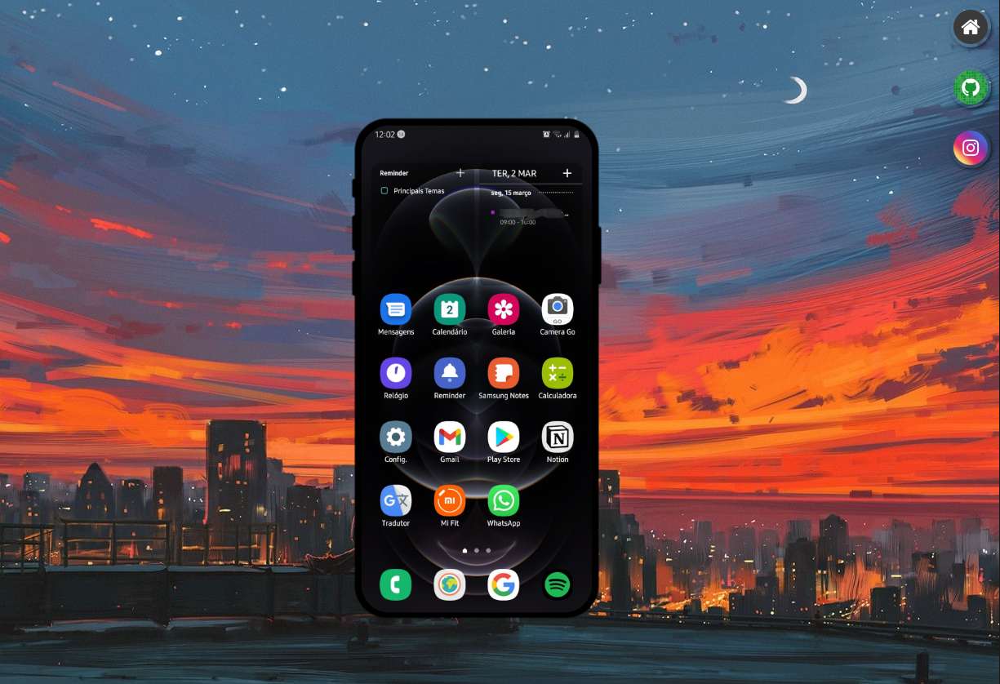

<h1 align="center"> Redes sociais </h1>

Projeto de aprendizado HTML + CSS.  

  <a href="#-tecnologias">Tecnologias</a>&nbsp;&nbsp;&nbsp;|&nbsp;&nbsp;&nbsp;
  <a href="#-projeto">Projeto</a>&nbsp;&nbsp;&nbsp;|&nbsp;&nbsp;&nbsp;
  <a href="#-layout">Layout</a>&nbsp;&nbsp;&nbsp;|&nbsp;&nbsp;&nbsp;

 

  

## 🚀 Tecnologias

Esse projeto foi desenvolvido com as seguintes tecnologias:

- HTML e CSS
- Git e Github

## 💻 Projeto

Projeto para aprendizado.

- [Acesse o projeto finalizado, online](https://github.com/matheusamartim/redes_sociais)

## 🔖 Layout

Você pode visualizar o layout do projeto através [desse link](https://matheusamartim.github.io/redes_sociais/).

---

Feito com ♥
